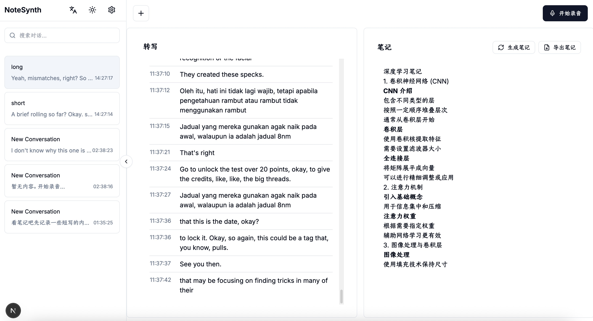

# NoteSynth

NoteSynth is an automatic note-taking tool that helps you record and summarize your lectures and meetings. It features real-time audio recording, transcription, and AI-powered summarization.



## Features

- Real-time audio recording
- Speech-to-text transcription
- Automatic content summarization
- Multi-language support (English and Chinese)
- Dark mode support
- Responsive design

## Tech Stack

- Next.js 15.2.1 (React 19)
- TypeScript 5
- Zustand for state management
- next-intl for internationalization
- Tailwind CSS for styling
- Radix UI for components

## Getting Started

1. Clone the repository:

```bash
git clone https://github.com/yourusername/notesynth.git
cd notesynth
```

2. Install dependencies:

```bash
npm install
```

3. Start the development server:

```bash
npm run dev
```

4. Open [http://localhost:3000](http://localhost:3000) with your browser to see the result.

## Usage

1. Click the settings icon to configure your API settings (API Base URL and API Key)
2. Click the "New Conversation" button to create a new recording session
3. Click the "Start Recording" button to begin recording
4. Speak into your microphone
5. Click "Stop Recording" when you're done
6. The audio will be automatically transcribed and summarized
7. View your transcription and summary in the respective panels

## Contributing

Contributions are welcome! Please feel free to submit a Pull Request.

## License

This project is licensed under the MIT License - see the [LICENSE](LICENSE) file for details. 